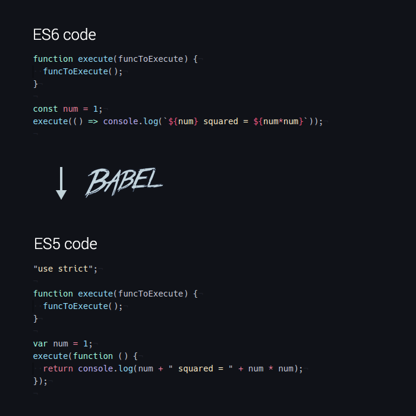

# Palesterick

<br>

<br>
#### Yuri Gomes

---

## O Que é ES6?

<br>


---

## Novas Funcionalidades

---

@title[Let]

<p><span class="slide-title">Let</span></p>

```javascript
//ES5
var y = 5
if (true) {
  var x = 5 + y;
}

console.log(x); //10
```
---

<p><span class="slide-title">Let</span></p>

```javascript
//ES6
if (true) {
  let y = 5;
}
console.log(y); // ReferenceError: y não está definido
```

---

@title[Const]

<p><span class="slide-title">Const</span></p>
<br>
Declara uma constante apenas de leitura.

```javascript
//ES5
const a = 1;
a = 2; // Error


```
Note:
É um tipo de variavel de somente leitura, não pode ser reatribuida
Declarar o valor, quando instanciar a variavel
---

@title[Arrow Functions]

<p><span class="slide-title">Arrow Functions</span></p>

```javascript
var arr = [1, 2, 3];
var squares = arr.map(function (x) { return x * x });
```

Note:
Sintaxe da es5, muita mais verbosa
---

<p><span class="slide-title">Arrow Functions</span></p>

```javascript
const arr = [1, 2, 3];
const squares = arr.map(x => x * x);

```

Note:
Nova sintaxe
Quando é somente um parametro, não é necessário usar as chaves
Também pode ser omitido a palavra return, caso seja somente uma instrução
---

<p><span class="slide-title">Arrow Functions</span></p>

```javascript
function UiComponent() {
    var _this = this; // (A)
    var button = document.getElementById('myButton');
    button.addEventListener('click', function () {
        console.log('CLICK');
        _this.handleClick(); // (B)
    });
}

UiComponent.prototype.handleClick = function () {
    ···
};

```

Note:
Explicar o hoisting
---

<p><span class="slide-title">Arrow Functions</span></p>

```javascript

function UiComponent() {
    var button = document.getElementById('myButton');
    button.addEventListener('click', () => {
        console.log('CLICK');
        this.handleClick(); // (A)
    });
}

```

Note:
Explicar que mantém o this do escopo de onde foi invocado
Não precisa do bind
---

@title[Template String]

<p><span class="slide-title">Template String</span></p>

```javascript
//ES5
var a = 5;
var b = 10;
console.log("Quinze é " + (a + b) + " e\nnão " + (2 * a + b) + ".");
// "Quinze é 15 e não 20."
```
---

<p><span class="slide-title">Template String</span></p>

```javascript
//ES6
var a = 5;
var b = 10;
console.log(`Quinze é ${a + b} e\nnão ${2 * a + b}.`);
// "Quinze é 15 e
// não 20."
```
Note:
Variaveis são inputadas através das ${}
---

@title[Destructuring Assignment]

<p><span class="slide-title">Destructuring Assignment</span></p>

```javascript
const atributosPersonagem = {
  forca: 20,
  mentalidade: 40,
  resistencia: 10
};

let { forca, mentalidade } = atributosPersonagem;
console.log(forca);//20
console.log(mentalidade);//40
```

---

@title[Default Arguments]

<p><span class="slide-title">Default Parameters</span></p>

```javascript
//ES5
function multiplicar(a, b) {
  b = typeof b !== "undefined" ? b : 1;

  return a * b;
}

multiplicar(5); // 5
```

---

<p><span class="slide-title">Default Parameters </span></p>

```javascript
// ES6
function multiplicar(a = 10, b = 1) {
  return a * b;
}
multiplicar()//10
multiplicar(5); // 5
```

---

@title[Named Parameters]

<p><span class="slide-title">Named Parameters</span></p>

```javascript
//ES5

function selectEntries(options) {
  options = options || {};
  var start = options.start || 0;
  var end = options.end || -1;
  var step = options.step || 1;
}
```

---

<p><span class="slide-title">Named Parameters</span></p>

```javascript
function selectEntries({ start = 0, end = -1, step = 1 } = {}) {}
```

---

@title[Rest]

<p><span class="slide-title">Rest</span></p>

```javascript
var arr1 = ["a", "b"];
var arr2 = ["c"];
var arr3 = ["d", "e"];

console.log(arr1.concat(arr2, arr3)); // [ 'a', 'b', 'c', 'd', 'e' ]
```

---

<p><span class="slide-title">Rest</span></p>

```javascript
const arr1 = ["a", "b"];
const arr2 = ["c"];
const arr3 = ["d", "e"];

console.log([...arr1, ...arr2, ...arr3]);
// [ 'a', 'b', 'c', 'd', 'e' ]
```

---

@title[Object Literals]

<p><span class="slide-title">Object Literals</span></p>

```javascript
var obj = {
    foo: function () {
        ···
    },
    bar: function () {
        this.foo();
    }, // trailing comma é legal em es5
}
```
---

<p><span class="slide-title">Object Literals</span></p>

```javascript
const obj = {
    foo() {
        ···
    },
    bar() {
        this.foo();
    },
}
```
---

@title[Classes]

<p><span class="slide-title">Classes</span></p>

```javascript
class Carro {
  constructor() {
    this.cor = "Vermelho";
    this.marca = "Volkswagen";
    this.ano = "2018";
  }

  marca() {
    return console.log(`A marca do carro é ${this.marca}`);
  }
}
```

---

@title[Arrays]

<p><span class="slide-title">Arrays</span></p>


---

<p><span class="slide-title">Array.From()</span></p>

Array.from(arrayLike[, mapFn[, thisArg]])

```javascript

function f() {
  return Array.from(arguments);
}

f(1, 2, 3); 
// [1, 2, 3]

Array.from([1, 2, 3], x => x + x);      
// [2, 4, 6]

```

---

<p><span class="slide-title">for..of</span></p>

```javascript
//for..of
const arr = ['a', 'b', 'c'];
for (const elem of arr) {
    console.log(elem);// a , b , c
}
```
---

<p><span class="slide-title">Array.Fill()</span></p>

.fill(value[, start = 0[, end = this.length]])

```javascript
//Array.fill()
let arr = [1, 2, 3, 4, 5];
arr.fill(2); // [2, 2, 2, 2, 2]
```

---

<p><span class="slide-title">Array.of()</span></p>

Array.of(element0[, element1[, ...[, elementN]]])

```javascript
Array.of(1);         // [1]
Array.of(1, 2, 3);   // [1, 2, 3]
Array.of(undefined); // [undefined]
```
Note:
O método Array.of() cria um nova instância do Array com um número variável de argumentos, independentemente do número ou do tipo dos argumentos.

---

<p><span class="slide-title">Array.entries()</span></p>

```javascript
const numbers = [1, 2, 3]; 
const val = numbers.entries(); 
console.log(val.next().value); // [0, 1]  
console.log(val.next().value); // [1, 2]
console.log(val.next().value); // [2, 3]
```
---

<p><span class="slide-title">Array.findIndex()</span></p>

```javascript
const numbers = [1, 2, 3]; 
const oddNumber = numbers.findIndex((x) => x % 2 == 1); 
console.log(oddNumber); // 0 
```
---

@title[Set]

<p><span class="slide-title">Set</span></p>

```javascript
var mySet = new Set();
mySet.add(1);
mySet.add("some text");
mySet.add("foo");

mySet.has(1); // true
mySet.delete("foo");
mySet.size; // 2

for (let item of mySet) console.log(item);
// 1
// "some text
```

---

@title[Map]

<p><span class="slide-title">Map</span></p>

```javascript
var sayings = new Map();
sayings.set("dog", "woof");
sayings.set("cat", "meow");
sayings.set("elephant", "toot");
sayings.size; // 3
sayings.get("fox"); // undefined
sayings.has("bird"); // false
sayings.delete("dog");
sayings.has("dog"); // false
sayings.get("cat"); // meow
sayings.get("elephant"); //toot

for (var [key, value] of sayings) {
  console.log(key + " goes " + value);
};
// "cat goes meow"
// "elephant goes toot"

sayings.clear();
sayings.size; // 0
```

---

@title[Typescript]

<p><span class="slide-title">Typescript</span></p>


Note:
O TypeScript é um superset do JavaScript que fornece principalmente tipagem estática opcional, classes e interfaces. Um dos grandes benefícios é permitir que IDEs forneçam um ambiente mais rico para detectar erros comuns à medida que escrevemos nosso código

---

@title[Transpiladores]

<p><span class="slide-title">Transpiladores</span></p>


---

<p><span class="slide-title">Transpiladores</span></p>

---



--- 

<p><span class="slide-title">Coisas que tem, mas nem sei bixo</span></p>

- Generators e Interators
- Weak Map e Weak Set
- Meta Programação (Proxys e Reflect API)
- Flow (Static Type Check)
- ESNEXT(ES7, ES8...)

---

@title[Obrigado]

## Obrigado


